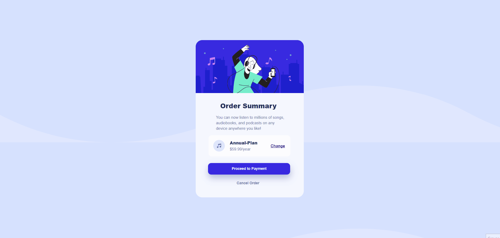
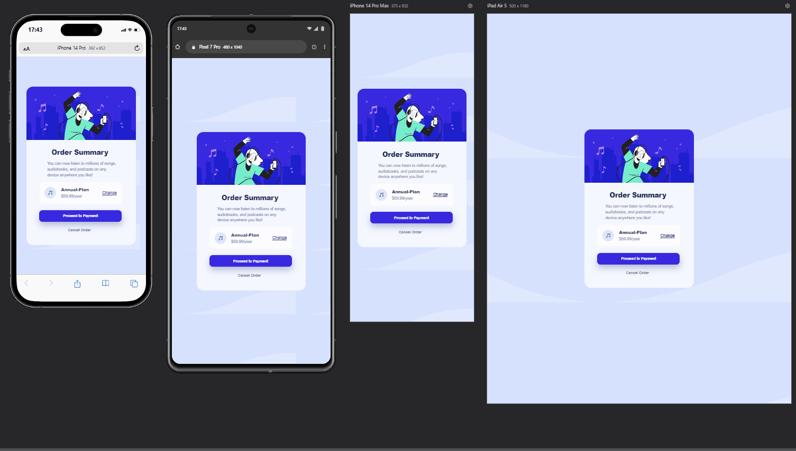

# Order Summary Component

Opa! boa noite como está sendo o final de vocês espero que bom, 😁 esse aqui é um projeto mais simples do Frontend Mentor, que fiz para dar mais uma praticada com HTML e CSS pois logo eu estarei começando a estudar JavaScript, esse aqui não tive muitas dificuldades e foi bem tranquilo. Obrigado por ler!

## Tecnologias utilizadas

- HTML
- CSS